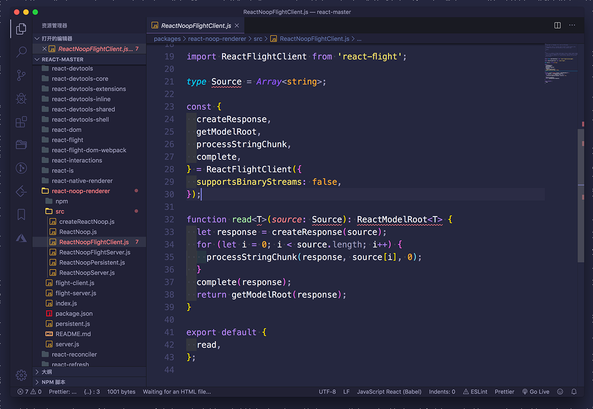

# # Polish Theme for [Visual Studio Code](http://code.visualstudio.com)

> A dark theme for [Visual Studio Code](http://code.visualstudio.com).

## Installation

1. Open the **Extensions** sidebar in VS Code
2. Search for `Polish Theme`
3. Click **Install**
4. Open the **Command Palette** with `Ctrl+Shift+P` or `⇧⌘P`
5. Select **Preferences: Polish Theme** and choose a Horizon variant.
6. Enjoy! 🎉
